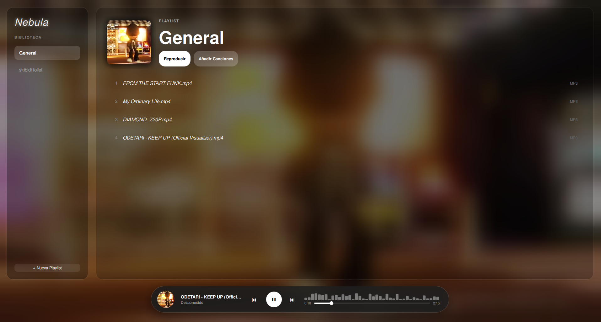

# 🌌 Nebula Music 

Reproductor de música minimalista y ultra ligero hecho en C++ y Qt6.



## ✨ Características
* 🚀 **Rendimiento:** Solo 228MB de RAM.
* 🎨 **Diseño:** Interfaz transparente y moderna (Aesthetic).
* 📂 **Formatos:** Soporte para MP4, M4A y MP3 con metadatos reales.

## 📦 Instalación
### Método Rápido (Recomendado)
Descarga el archivo `Nebula_Music.flatpakbundle` desde la sección de **Releases** e instálalo:
```bash
flatpak install Nebula_Music.flatpakbundle
